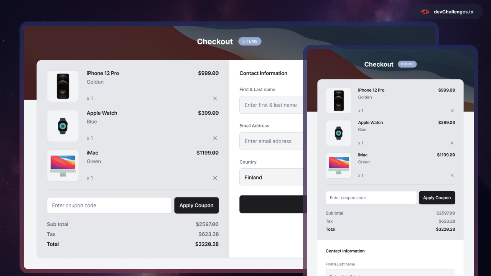

<h1 align="center">device-shop-checkout-master | devChallenges</h1>

   Solution for a challenge <a href="https://devchallenges.io/challenge/apple-shop-checkout-page-challenge" target="_blank">Device Shop Checkout</a> from <a href="http://devchallenges.io" target="_blank">devChallenges.io</a>.

  <h3>
    <a href="{https://your-demo-link.your-domain}">
      Demo
    </a>
     | 
    <a href="{https://your-url-to-the-solution}">
      Solution
    </a>
     | 
    <a href="https://devchallenges.io/challenge/apple-shop-checkout-page-challenge">
      Challenge
    </a>
  </h3>

<!-- TABLE OF CONTENTS -->

## Table of Contents

- [Overview](#overview)
  - [What I learned](#what-i-learned)
  - [Useful resources](#useful-resources)
- [Built with](#built-with)
- [Contact](#author)

<!-- OVERVIEW -->

## Overview

I improved my way of using CSS Grid and Flexbox with this simple project !
My goal was to really understand how to use Grids and Flexbox in CSS.

### What I learned

I learned a lot about CSS Grid and Flexbox and also improved my skills in CSS in general.
I had some difficulties when it came to make the website responsive, so I ain't gonna lie, I used Deepseek a little bit but even so, it still made some errors and I kinda handled it perfectly and the result came out good.
I had difficulties here :

    .all {
        display: grid;
        grid-template-columns: 1fr 1fr;
        grid-template-rows: 120px 120px 1fr 40px;
    }

    .container {
        grid-row: 2 / span 2;
        display: flex;
        flex-direction: column;
        align-items: center;
    }

    .container1,
    .container2 {
        width: 95%;
        padding: 6%;
    }

    .container1 {
        border-radius: 4% 4% 0 0;
    }

    .container2 {
        border-radius: 0 0 4% 4%;
    }

### Useful resources

- [CSS Grid](https://youtu.be/Jarz_GZG7-I?si=NaJ78s0pxNiGIlv_) - This helped me understand the basics of CSS Grid
- [CSS FlexBox](https://youtu.be/DPHgIIdrmFk?si=jUjUNAeIH-aLYW6B) - This helped me understand the basics of CSS FlexBox
- [Styling Placeholder](https://fr.w3docs.com/snippets/css/comment-changer-la-couleur-de-input-placeholder-html5-avec-css.html) - I didn't know how to style placeholders so this helped me

### Built with

- Semantic HTML5 markup
- CSS custom properties
- Flexbox
- CSS Grid

## Author
- GitHub [@Tiana1607](https://github.com/Tiana1607)
