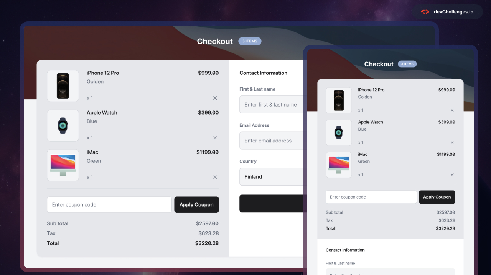

<!-- Please update value in the {}  -->

<h1 align="center">device-shop-checkout-master | devChallenges</h1>

   Solution for a challenge <a href="https://devchallenges.io/challenge/apple-shop-checkout-page-challenge" target="_blank">Device Shop Checkout</a> from <a href="http://devchallenges.io" target="_blank">devChallenges.io</a>.

  <h3>
    <a href="{https://your-demo-link.your-domain}">
      Demo
    </a>
     | 
    <a href="{https://your-url-to-the-solution}">
      Solution
    </a>
     | 
    <a href="https://devchallenges.io/challenge/apple-shop-checkout-page-challenge">
      Challenge
    </a>
  </h3>

<!-- TABLE OF CONTENTS -->

## Table of Contents

- [Overview](#overview)
  - [What I learned](#what-i-learned)
  - [Useful resources](#useful-resources)
- [Built with](#built-with)
- [Contact](#contact)

<!-- OVERVIEW -->

## Overview

<!--
Introduce your projects by taking a screenshot or a gif. Try to tell visitors a story about your project by answering:

- What have you learned/improved?
- Your wisdom? :)
-->

### What I learned

<!-- Use this section to recap over some of your major learnings while working through this project. Writing these out and providing code samples of areas you want to highlight is a great way to reinforce your own knowledge. -->

### Useful resources

<!--
- [Example resource 1](https://www.example.com) - This helped me for XYZ reason. I really liked this pattern and will use it going forward.
- [Example resource 2](https://www.example.com) - This is an amazing article which helped me finally understand XYZ. I'd recommend it to anyone still learning this concept.
-->
- [CSS Grid](https://youtu.be/Jarz_GZG7-I?si=NaJ78s0pxNiGIlv_) - This helped me understand the basics of CSS Grid
- [CSS FlexBox](https://youtu.be/DPHgIIdrmFk?si=jUjUNAeIH-aLYW6B) - This helped me understand the basics of CSS FlexBox

### Built with

- Semantic HTML5 markup
- CSS custom properties
- Flexbox
- CSS Grid

## Author
- GitHub [@Tiana1607](https://github.com/Tiana1607)
